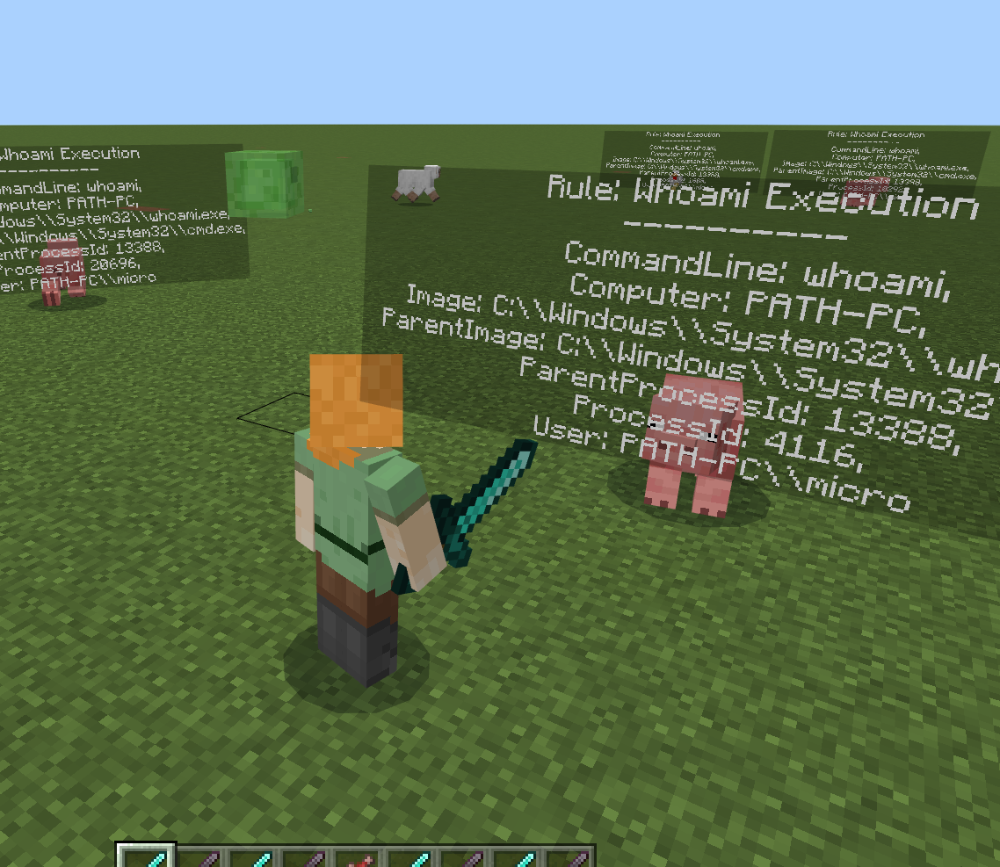
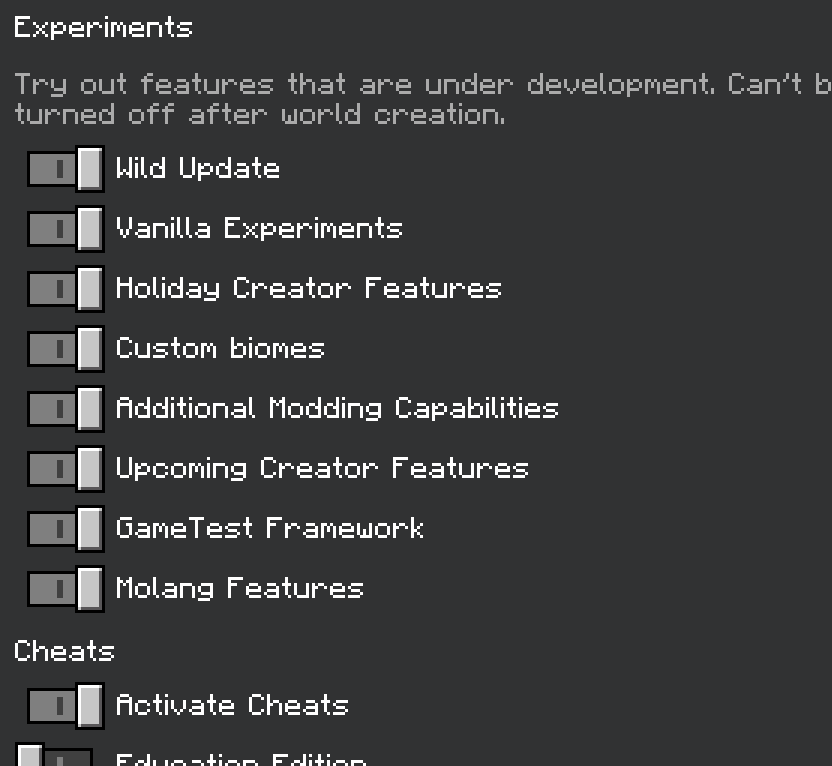

**SIEMCraft - Security Information and Event Management in Minecraft**

(please do not take this serioussly, for more information read [this blog post](https://blog.tofile.dev/))

Inspired by [Kubecraftadmin](https://github.com/erjadi/kubecraftadmin), this project allows you to monitor
and detect intrusions across your entire Windows domain, while still mining mad diamond.



- [How it works](#how-it-works)
  - [Event Log collecter](#event-log-collecter)
  - [SIGMA Rule detection engine](#sigma-rule-detection-engine)
  - [Entity generator](#entity-generator)
  - [Player action responder](#player-action-responder)
- [How it works - diagram](#how-it-works---diagram)
- [Building](#building)
  - [Binary Controller](#binary-controller)
  - [Minecraft Addons](#minecraft-addons)
  - [Rules](#rules)
- [Installing](#installing)
  - [Controller](#controller)
  - [Addons](#addons)
- [Running](#running)
  - [Controller](#controller-1)
  - [Addons](#addons-1)
- [Why would you make this?](#why-would-you-make-this)

# How it works
SIEMCRAFT is a project that combines a standalone executable 'controller', with a Minecraft addon, designed to
enable a person to manage and respond to security alerts from within Minecraft. The project has a
number of elements:
## Event Log collecter
Using [RawSec's Win32 library](https://github.com/0xrawsec/golang-win32), SIEMCraft subscribes to
various Windows Event logs, to collect events from
- Microsoft Sysmon
- ETW (via [Sealighter](https://github.com/pathtofile/Sealighter))
- Security, System, and Applicaiton Event logs

Using Windows Event Forwarding (WEF), you can have SIEMCRAFT run from the central machine and collect
event from an entire Windows Domain

## SIGMA Rule detection engine
SIEMCraft will then run events through a user-supplied list of [SIGMA](https://github.com/SigmaHQ/sigma) detection rules
using [Bradley Kemp's library](https://github.com/bradleyjkemp/sigma-go), to detect supsicious and malicious activity within the raw events. Using SigmaHQ's ruleset is also supported

## Entity generator
If a rule detects suspicious behaviour, it will trigger the creation of new entity within a person's Minecraft server,
nearby to the player. This entity will display information about:
- The name of the rule triggered
- The Machine name the rule was triggered on
- The user responsible for the process that triggered the rule
- The Image, CommandLine, and PID of the Process
- The Image and PID of the Parent Process
- Other relevant information

Different types of entities are created depending on the detection severity:
- Low: Chicken
- Medium: Pig or Cow
- High: [Spider, Panda, or Bear](https://adversary.crowdstrike.com/en-US/adversary/cozy-bear/)

## Player action responder
If the entity is killed by a player weilding a `Diamond Sword`, SIEMCRAFT will then kill either the process or the parent process, so long as the process image is one of
- cmd.exe
- pwsh.exe
- powershell.exe
- wword.exe

If the entity is killed by any other means the event is silently dismissed.

# How it works - diagram


# Building
You can grab pre-built artefacts from the [releases](https://github.com/pathtofile/siemcraft/releases) page.

Otherwise, there are two parts to build:
## Binary Controller
```bash
go build -o siemcraft.exe ./src
```

## Minecraft Addons
There are two Minecraft addons, a 'behaviour' pack and an 'entity' pack. Packs are just ZIPs, and can be combined
into a single `.mcaddon` ZIP for extra portability:
```powershell
# Windows
Compress-Archive -Path "siemcraft_addon_behavior" -DestinationPath "siemcraft_addon_behavior.mcpack" -Force
Compress-Archive -Path "siemcraft_addon_resource" -DestinationPath "siemcraft_addon_resource.mcpack" -Force
Compress-Archive -Path "*.mcpack -DestinationPath" "siemcraft.mcaddon" -Force

# Linux
zip -r siemcraft_addon_behavior.mcpack siemcraft_addon_behavior
zip -r siemcraft_addon_resource.mcpack siemcraft_addon_resource
zip -r siemcraft_addon_resource.mcaddon *.mcpack
```

## Rules
You will also need some SIGMA rules for SIEMCRAFT to comapre raw events to.
Either use the ones in this repository's [rules directory](rules/), or use
[SIGMA's community rules](https://github.com/SigmaHQ/sigma). Note not all of these rules work with SIEMCRAFT
(see [this](https://github.com/bradleyjkemp/sigma-go/issues/9) discussion).

# Installing
## Controller
Place the siemcraft binary anywhere on the machine where the event logs are being generated (usually the same
machine as minecraft).

## Addons
To install the Minecraft addon, double-click on the `.mcpack` from the machine with the Minecraft client.
This should install both packs, which you can confirm by clicking `Settings` in Minecraft:


# Running
## Controller
Start the SIEMCRAFT controller binary from an elevated prompt, giving it the path to the folder containing the SIGMA rules:
```powershell
$> siemcraft.exe --rules .\rules
[r] Parsing SIGMA rules from: .\rules
[r]    Found rule: Security Logon
[r]    Found rule: Where Execution
[r]    Found rule: Whoami Execution
[r] Number of rules found: 3
[e] Starting event subscription
[e] Subscribing to Event Log channels:
[e]   - Microsoft-Windows-Sysmon/Operational
[e]   - Security
[m] starting SIEMCraft, run this command to connect:
    /connect 127.0.0.1:8000/ws
```

Siemcraft accepts the following commandline options:
```
  -bind string
        Address to bind websocket to (default "127.0.0.1")
  -channels value
        Comma-seperated list of event logs to subscribe to
        (default ["Microsoft-Windows-Sysmon/Operational", "Security"])
  -fakeEvents
        Don't subscript to event logs, just fake generate them
  -noKill
        Never attempt to kill a process
  -port string
        Port to bind websocket to (default "8000")
  -rules string
        Folder containing SIGMA rules (default ".\\rules")
```

## Addons
First, if running SIEMCRAFT on the same local host as the Minecraft client, you need to allow Minecraft to
talk to your local network. Run this in an elevated PowerShell:
```powershell
# First find the "Package Family Name" of Minecraft, which should look like like 'microsoft.minecraftuwp_RANDOM_STRING'
$family_name=(Get-AppxPackage '*minecraft*').PackageFamilyName

# Enable minecraft to reach loopback network
cmd.exe /C "checknetisolation loopbackexempt -a -n=$family_name"

# Check it worked, you should see minecraft here
checknetisolation loopbackexempt -s
```

Next, create a new Minecraft world with the following options:
- All cheats and experiments enabled, and achievements turned off
- Both the SIEMCRAFT 'Resource' and 'Behaviour' packs activated 




Once the Map is created, open up the console and type this command to connect
to the SIEMCRAFT controller
```
/connect <ip_address>:<port>/ws
```

By default the IP Address and port are:
```
/connect 127.0.0.1:8000/ws
```


You should see positive output in both the Minecraft UI and in the Controller's output.

# Why would you make this?
See [the blog post](https://blog.tofile.dev/), but tl;dr is because I'm an idiot who was bored.
I also presented this "work" at a local security meetup, you can see the slides [here](/assets/diamond_talk_sharable.pdf)
(but the blog has more info, and the talk wasn't recorded).
